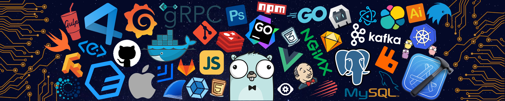

  <h1>🌟 Hi there, I'm Yazan Aladib 🌟</h1>
  

---

### 👨‍💻 About Me 

<table>
  <tr>
    <td width="70%">
      <ul>
        <li>🎓 I’m a Software Engineer, currently diving deeper into Web Development and Artificial Intelligence.</li>
        <li>🌱 Excited to collaborate on open-source projects and expand my experience in building impactful software.</li>
        <li>🎯 2024 Goals: Refine my web development skills and build a strong foundation in AI to advance my career in both fields.</li>
        <li>🧩 Fun fact: I’m pretty sure half my code works because I believe in it.</li>
      </ul>
    </td>
    <td width="30%">
      
    </td>
  </tr>
</table>

---

### 🛠️ Languages and Tools:

  
  
  
  
  
  
  
  
  
  
  
  
  
  
  
  
  

---

  

  

---

### 📫 Connect with Me

  
  
  
    

Thanks for stopping by! ✨
